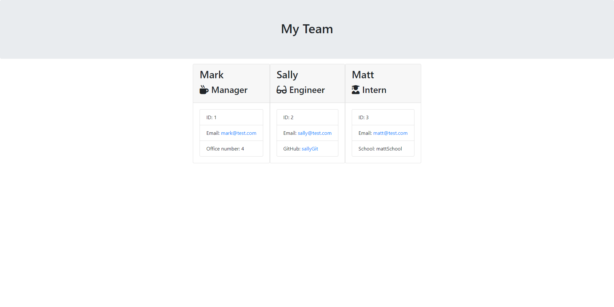

# Module 12 Challenge: Team Profile Generator (OOP)

## Description

Create a working Node.js command-line application that takes in information about employees on a software engineering team, then generates an HTML webpage that displays summaries for each team member. The application uses the [Inquirer package](https://www.npmjs.com/package/inquirer) to take in user input.

---

## User Story

```
AS A team manager
I WANT a generate a webpage that displays my team's basic info
SO THAT a user has quick access to their emails and GitHub profiles
```

---

## Acceptance Criteria

- The tests for the classes (in the `_tests_` directory) must ALL pass using the [Jest package](https://www.npmjs.com/package/jest)
- Uses the [Inquirer package](https://www.npmjs.com/package/inquirer).
- The application must have `Employee`, `Manager`, `Engineer`, and `Intern` classes.
- When a user starts the application, they are prompted to enter the **team manager**’s:
  - Name
  - Employee ID
  - Email address
  - Office number
- When a user enters those requirements, the user is presented with a menu with the option to:
  - Add an engineer
  - Add an intern
  - Finish building the team
- When a user selects the **engineer** option, the user is prompted to enter the following and then the user is taken back to the menu:
  - Engineer's Name
  - ID
  - Email
  - GitHub username
- When a user selects the intern option, the user is prompted to enter the following and then the user is taken back to the menu:
  - Intern’s name
  - ID
  - Email
  - School
- When a user decides to finish building their team, they select the **Finish building the team** option in the menu to exit the application and generate the HTML

---

## Usage

The application will be invoked by using the following command in the terminal:

```
node index.js
```

Instructions on how to use the application will be presented via a welcome message when the app is run.

---

## Mock-Up

### Portfolio Webpage Sample Screenshot

- The index.html can be found [here](./output/team.html)
- Please see below a portfolio sample webpage screenshot:

## 

### Demo Video

- Please find a demo video of the application [here](./assets/team-portfolio-sample-demo.mp4)

---

## License

Please refer to the LICENSE in the repo.
